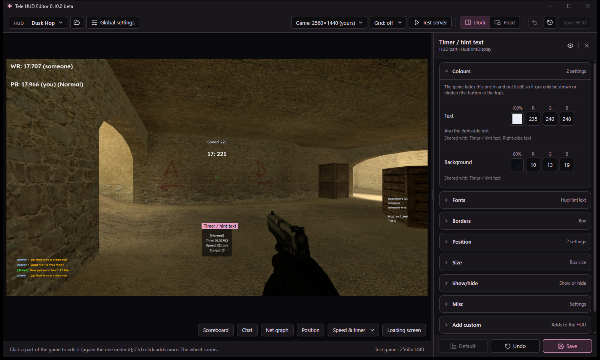
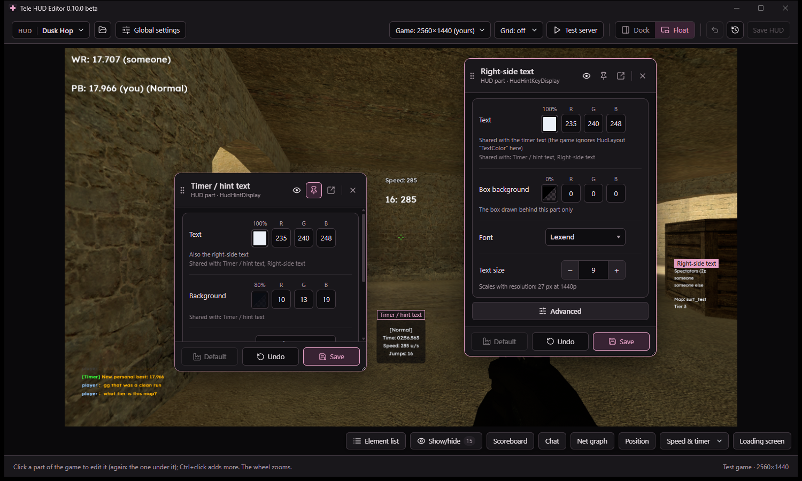
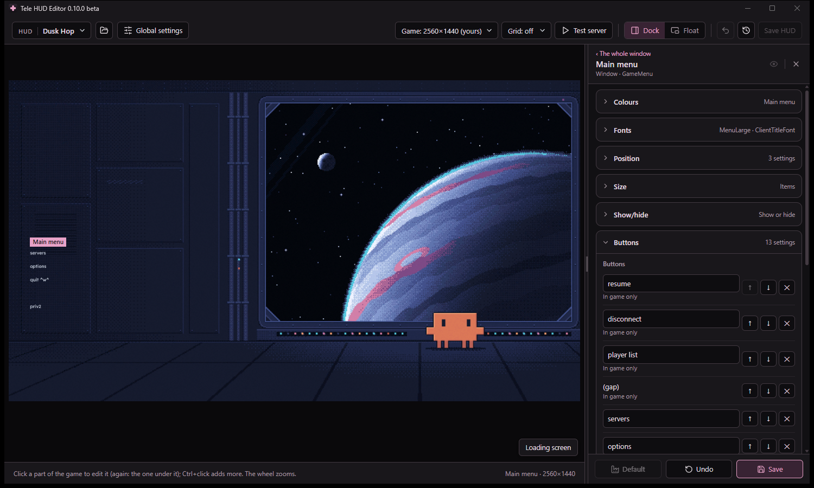

# Tele HUD Editor (beta)

Edit Counter-Strike: Source HUDs while the game is running. Click a part of the game, change it, and see the change
straight away. No text files.

## Download

Get **CSSHudEditor.exe** (or the .zip with its license files) from the [Releases](../../releases) page. It is one
file: nothing to install. You need Windows 10 or 11 and Counter-Strike: Source on Steam.

This is a **beta**: back up any HUD you care about before you edit it.

## Getting started

1. Open `CSSHudEditor.exe`.
2. Pick a HUD: one from your custom folder, a new one (**Start a new HUD**), or a downloaded one (drop its folder or
   its .zip, .rar or .7z on the editor). The editor starts the game with that HUD and shows it inside the editor.
   A game you started yourself with `-insecure` is joined instead.
3. Pick **Dock** or **Float** (you can switch any time at the top).
4. Click anything in the game: the health, the scoreboard, the main menu, a window. Change its colours, fonts, size
   and place, and the game updates as you go.
5. **Save HUD** keeps your changes. **Ctrl+Z** undoes. A few settings show only after a game restart: the yellow
   **⚠** by Save HUD lists them and restarts the game for you.

## Dock or Float

**Dock** keeps a part's settings in a panel beside the game. **Float** opens a card beside the part you click: drag it
anywhere, pin it to keep it open while you click other parts, or pop it out into a window of its own (another screen
too).

## What you can do

- **Change any part**: colours, fonts, borders (a colour for each side), size, position, show or hide it. **Simple
  mode** shows the main settings, **Advanced** every tab. Every setting was checked in the game.
- **Fonts for every screen size**, and **Global settings** to change the HUD's fonts all at once.
- **Add your own pictures, texts and boxes**, animated GIFs too, on the HUD and in windows (scoreboard, team and class
  select, MOTD, loading screen, buy menu, spectator bars).
- **The main menu**: rename and reorder its buttons, add buttons that join a server or run a command, set its colours
  and background.
- **Game settings the HUD can carry**: scoreboard name colours, radar opacity, the net graph and the position text.
- **See everything without joining servers**: toggles keep the scoreboard, chat, net graph and position text on
  screen, a test server has sample timer and speed texts and a full scoreboard, and the loading screen stays open
  while you edit it.
- **Save one part at a time**, or go back to how the HUD was when you imported it.

## Good to know

- **VAC:** the editor starts the game with `-insecure`, which plugins need, so that game can't join VAC-secured
  servers. Starting CS:S from Steam as usual is not affected, and your HUD works there like any other.
- **The plugin:** the editor keeps a small plugin in `cstrike/addons` (`schemereload.dll`). Its `.vdf`, which makes the
  game load it, is only there while the editor starts the game (`schemereload.vdf.off` otherwise), so a game started
  from Steam doesn't load it. To remove it, delete `schemereload.dll` and the `.vdf` / `.vdf.off`.
- **Windows warning:** the exe isn't signed, so Windows may say it "protected your PC" the first time. Click
  *More info*, then *Run anyway*.

## Building from source

You need the Visual Studio 2022 Build Tools (C++), [Source SDK 2013](https://github.com/ValveSoftware/source-sdk-2013)
checked out in `hudreload/sdk/`, and the WebView2 SDK (the `Microsoft.Web.WebView2` NuGet package, unzipped) in
`app/webview2/`. `build-all.bat` builds the plugin, installs it into the game and builds `app/CSSHudEditor.exe`;
`app\build.bat` builds only the exe.

## License

MIT, see [LICENSE](LICENSE). Parts made by others (Valve's Source SDK, Microsoft's WebView2) keep their own licenses:
see [licenses/THIRD_PARTY_NOTICES.txt](licenses/THIRD_PARTY_NOTICES.txt). Not made or endorsed by Valve.
