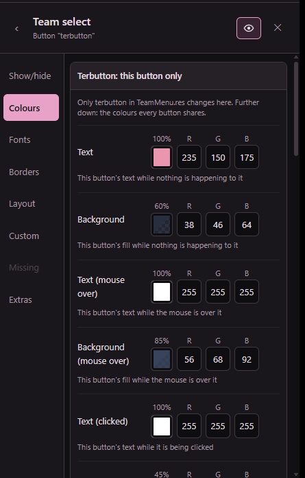
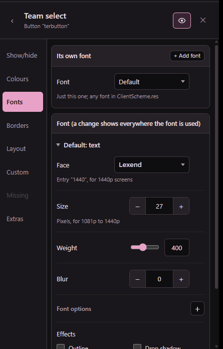
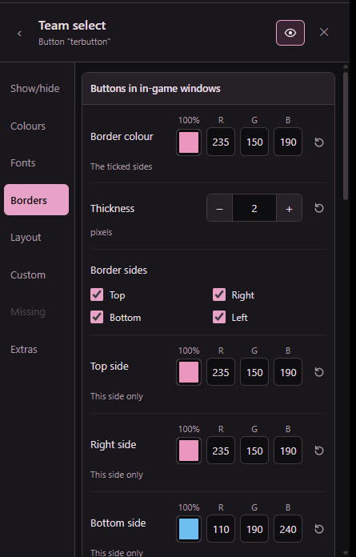

# Tele HUD Editor (beta)

Edit Counter-Strike: Source HUDs while the game is running. Click a part of the game, change it, and see the change
straight away. No text files.

## Download

Get **CSSHudEditor.exe** (or the .zip with its license files) from the [Releases](../../releases) page. It is one
file: nothing to install.

You need:
- Windows 10 or 11
- Counter-Strike: Source on Steam

This is a **beta**: back up any HUD you care about before you edit it.

## Getting started

1. Quit CS:S, then open `CSSHudEditor.exe`.
2. Pick a HUD to edit: one from your custom folder, a new one (**Start a new HUD**), or a downloaded one: drop its
   folder or its .zip, .rar or .7z on the editor (a copy goes into your custom folder).
   The editor then starts the game with only that HUD and shows it inside the editor.
3. Click anything in the game: the health, the scoreboard, the main menu, a window. Its settings show on the right.
4. Change colours, fonts, sizes and places. The game updates as you go.
5. **Save HUD** keeps your changes, **Ctrl+Z** undoes, **Discard changes** goes back to the last save. A few settings
   only show after a game restart: the yellow **⚠** by Save HUD lists them and restarts the game for you.

## See it in action

Click a part and its settings show on the right, a tab for each kind. Here, a team select button's colours, its font,
and its border with a colour for each side:

  
  
  

**Menus too:** the main menu, its buttons, colours and background, and every in-game window:

## What you can do

- **Recolour the whole HUD in a few clicks** with *Colours by kind*: backgrounds, text, borders, buttons, highlights,
  HUD numbers, warnings.
- **Change any part**: colours, fonts, size, position, show or hide it. Every setting was checked in the game, and the
  ones the game ignores aren't offered.
- **Borders** with their sides, thickness and a colour for each side.
- **Fonts** for every screen size: split a HUD's fonts into resolutions so they look the same on any monitor.
- **Add your own pictures, texts and boxes**, animated GIFs too, on the HUD and in windows (scoreboard, team and class
  select, MOTD, loading screen, buy menu, spectator bars), and command buttons (`say !rtv`...) on team and class select.
- **Set the main menu background** and buttons, the window backdrop colour and your own **MVP star** picture.
- **Game settings the HUD can carry**: scoreboard name colours, radar opacity, the net graph and the position text
  (`cl_showpos`), kept in the HUD and set when the game starts.
- **Edit the loading screen**: the game holds it open while you work on it.
- **See everything without joining servers**: toggles keep the scoreboard, chat, net graph and position text on screen,
  and a test game has sample timer and speed texts, a full scoreboard, the round-end and killer panels and more.

## Good to know

- **VAC:** the editor starts the game with `-insecure`, which plugins need. That game can't join VAC-secured servers.
  Starting CS:S from Steam as usual is not affected, and your HUD works there like any other.
- **The plugin:** the editor puts a small plugin in `cstrike/addons` (`schemereload.dll`, and `schemereload.vdf`, which
  makes the game load it). A game started from Steam would load it too and then couldn't join VAC-secured servers, so
  the editor puts the `.vdf` in only as it starts the game and moves it aside (`schemereload.vdf.off`) once the plugin
  is up. To remove the plugin, delete `schemereload.dll` and the `.vdf` / `.vdf.off`.
- **Game settings in a HUD** (name colours, radar opacity, net graph) run from the HUD's `cfg/valve.rc` before your
  `autoexec.cfg`, so your own autoexec still wins.
- **Windows warning:** the exe isn't signed, so Windows may say it "protected your PC" the first time. Click
  *More info* and then *Run anyway*.

## Building from source

You need the Visual Studio 2022 Build Tools (C++) and two SDKs that aren't in this repo:
- [Source SDK 2013](https://github.com/ValveSoftware/source-sdk-2013) checked out in `hudreload/sdk/`
- the WebView2 SDK (the `Microsoft.Web.WebView2` NuGet package, unzipped) in `app/webview2/`

`build-all.bat` builds the plugin, installs it into the game and builds `app/CSSHudEditor.exe` (it closes the game and
the editor first). `app\build.bat` builds only the exe.

## License

MIT, see [LICENSE](LICENSE). Parts made by others (Valve's Source SDK, Microsoft's WebView2) keep their own licenses:
see [licenses/THIRD_PARTY_NOTICES.txt](licenses/THIRD_PARTY_NOTICES.txt). Not made or endorsed by Valve.
